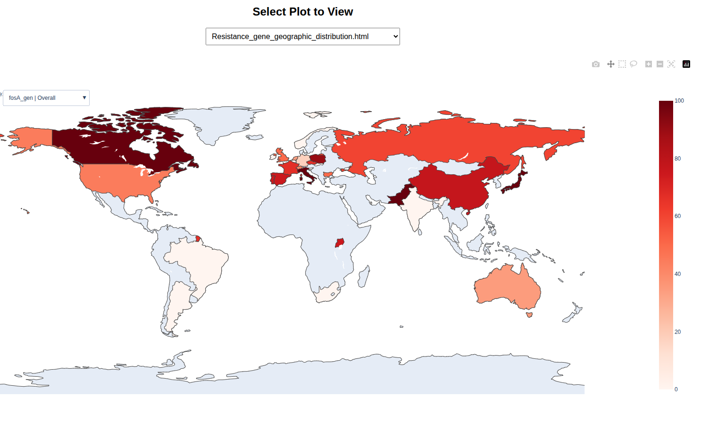
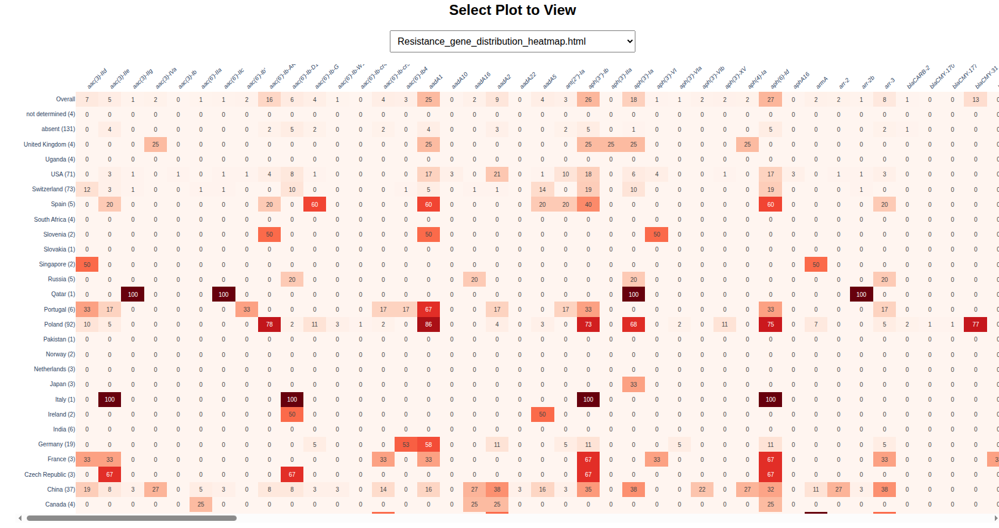
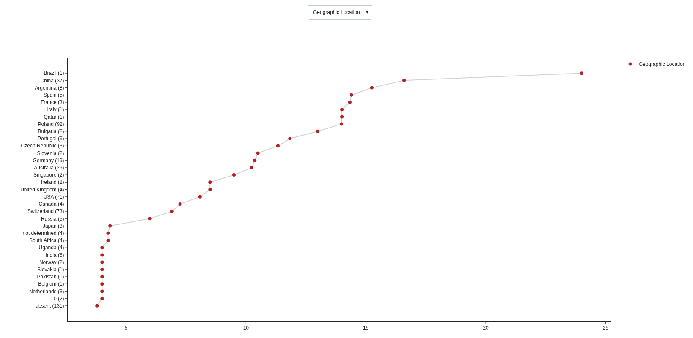
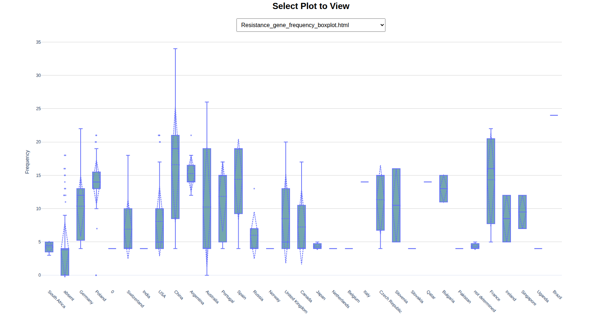
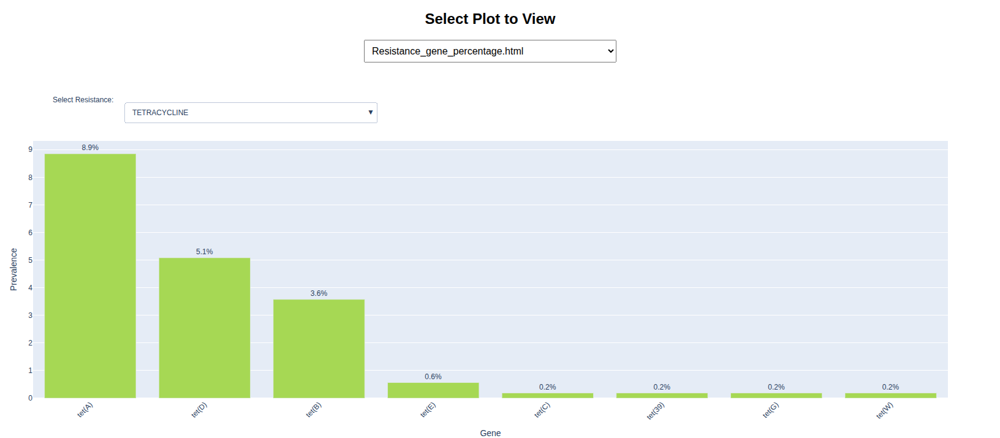
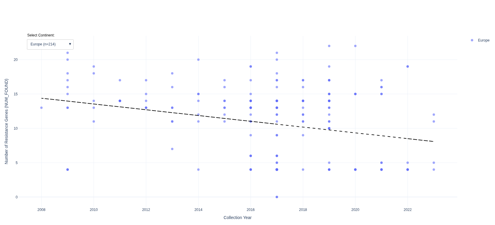

# PanResistome: Scalable Pipeline for Global Antimicrobial Resistance Analysis

## Overview

**PanResistome** is a scalable, modular, and reproducible bioinformatics pipeline built using [Nextflow](https://www.nextflow.io/). It automates the end-to-end analysis of global antimicrobial resistance (AMR) patterns in bacterial populations using genome assemblies. The pipeline is designed for researchers working in microbial genomics, resistome surveillance, and public health, enabling large-scale comparative analysis of resistance gene profiles across time and geography.

PanResistome integrates several state-of-the-art tools including:

* [**FetchM**](https://github.com/Tasnimul-Arabi-Anik/FetchM): for fetching genome assemblies and standardized NCBI metadata
* [**ABRicate**](https://github.com/tseemann/abricate): for resistance gene annotation using curated ANCBI databases
* [**PanR2**](https://github.com/Tasnimul-Arabi-Anik/PanR2): for downstream statistical analysis and interactive visualization of resistome data

## Key Features

* 🔄 **Fully automated** end-to-end pipeline from genome download to visualization
* 🧬 **Panresistome analysis** using resistance gene profiling from ABRicate
* 📊 **Visualization-ready outputs** including heatmaps, barplots, boxplots, and interactive HTML figures
* 📈 **Statistical summaries** and correlation-based insights on resistance gene distribution
* 🌍 **Geospatial & temporal comparison** of AMR gene prevalence
* 💡 **Epidemic signal detection** by comparing ARG prevalence across time and location
* ⚙️ **Nextflow-based** for reproducibility, scalability, and cloud/HPC compatibility

---

## Workflow Overview

```
          +-------------+        +-------------+        +-------------+        +-------------+
          |   FetchM    |  -->   |  ABRicate   |  -->   |   PanR2     |  -->   |   Output    |
          +-------------+        +-------------+        +-------------+        +-------------+
          | Download     |       | ARG annotation|      | Statistical   |      | Visualizations|
          | assemblies   |       | using databases|     | analysis      |      | & Summaries   |
          | & metadata   |       | like NCBI      |     | + plotting    |      |               |
          +-------------+        +-------------+        +-------------+        +-------------+
```

---

## 🚀 Getting Started

### ✅ Prerequisites

* [Nextflow](https://www.nextflow.io/)
* [Conda](https://docs.conda.io/en/latest/)
* Git

### 🔧 Installation

```bash
git clone https://github.com/Tasnimul-Arabi-Anik/PanResistome.git
cd PanResistome
```

## Input
Download ncbi_dataset.tsv of your target organism(s) from the [NCBI genome database](https://www.ncbi.nlm.nih.gov/datasets/genome/).
-**ncbi_dataset.tsv**

## 🧪 Running the Pipeline

```bash
nextflow run main.nf --input test.tsv --outdir results -profile conda --threads 24 

```

## 📦 Repository Structure

```
PanResistome/
├── main.nf
├── nextflow.config
├── envs/
│   ├── fetchm.yml
│   └── abricate.yml
├── results/
├── figures/ 
├── LICENSE
├── test.tsv
└── README.md
```

---

## 🧾 Command-line Options

### ✅ Required Arguments

| Argument   | Description                              |
| ---------- | ---------------------------------------- |
| `--input`  | Input TSV file listing genome accessions |
| `--outdir` | Output directory for results             |

### ⚙️ Optional Arguments for FetchM

| Argument    | Type   | Default | Description                                           |
| ----------- | ------ | ------- | ----------------------------------------------------- |
| `--checkm`  | float  | -       | Minimum CheckM completeness threshold (e.g., 90)      |
| `--ani`     | str    | all     | ANI filter status: OK, Inconclusive, Failed, or all   |
| `--sleep`   | float  | 0.5     | Time to wait between fetch requests (in seconds)      |
| `--host`    | str\[] | -       | Host species (e.g., "Homo sapiens", "Bos taurus")     |
| `--year`    | str\[] | -       | Filter by year or range (e.g., "2015" or "2015-2023") |
| `--country` | str\[] | -       | Filter by country (e.g., "Bangladesh", "USA")         |
| `--cont`    | str\[] | -       | Filter by continent (e.g., "Asia", "Africa")          |
| `--subcont` | str\[] | -       | Filter by subcontinent (e.g., "Southern Asia")        |

### 🧬 Optional Arguments for PanR2

| Argument   | Type  | Default | Description                                                |
| ---------- | ----- | ------- | ---------------------------------------------------------- |
| `--genep`  | float | -       | Minimum % gene presence to include in heatmaps             |
| `--nseq`   | int   | -       | Minimum number of sequences required per group in heatmaps |
| `--format` | str   | png     | Output format for figures (tiff, svg, png, pdf)            |

### 🔧 Other Options

| Argument    | Type | Default | Description                             |
| ----------- | ---- | ------- | --------------------------------------- |
| `--threads` | int  | 24      | Number of threads for abricate          |
| `--db`      | str  | ./db    | Directory containing abricate databases |
| `--help`    | flag | -       | Show help message and exit              |


## 📂 Output Structure

```bash
results/
└── <organism>/
    ├── abricate/            # Raw and summary AMR annotation results
    ├── figures/             # PNG, TIFF, and interactive HTML visualizations
    │   ├── heatmap/
    │   ├── mean_ARG/
    │   ├── html_files/
    │   ├── index.html       # Navigation page to generated reports
    │   └── Stat_analysis/
    ├── merged_output/       # Cleaned, joined resistance tables
    ├── metadata_output/     # Assembly, annotation and metadata summary
    └── sequence/            # Downloaded genome FASTA files        
```

You can open `index.html` in a browser for easy navigation of visual outputs.

---

## 🧼 Work Directory

By default, the `.nextflow` and `work/` directories are preserved for reproducibility. To remove intermediate files after a successful run:

```bash
nextflow clean -f
rm -rf work/
```

Only do this once you've verified the results.

---

## 📑 Example Report

You can view an example output here:

➡️ [**Interactive HTML Report**](https://tasnimul-arabi-anik.github.io/PanR2/)

Here’s an updated **📑 Example Report** section that includes the figures you mentioned and links to the interactive HTML dashboard:

---

## 📑 Example Report

You can explore an example output showcasing PanResistome's capabilities:

➡️ [**Interactive HTML Dashboard**](https://tasnimul-arabi-anik.github.io/PanR2/)

### Few Examples from index.html:

* 
  *Figure: Regional prevalence of antimicrobial resistance genes across sampled isolates.*

* 
  *Figure: Heatmap showing ARG distribution across genomes.*

* 
  *Figure: Average number of detected ARGs per genome grouped by region.*

* 
  *Figure: Frequency of specific ARGs in the dataset.*

* 
  *Figure: Variation in resistance gene presence across samples.*

* 
  *Figure: Correlation matrix of co-occurring ARGs.*

---

## 🧾 Citations

If you use this pipeline in your research, please cite the following tools:
Here are updated citation entries with proper formatting, pointing to the shared preprint for both FetchM and PanR2:

---

* **Nextflow:** Di Tommaso *et al.* (2017). Nextflow enables reproducible computational workflows. *Nature Biotechnology*. [https://doi.org/10.1038/nbt.3820](https://doi.org/10.1038/nbt.3820)
* **ABRicate:** Seemann T. ABRicate: Mass screening of contigs for antimicrobial and virulence genes. GitHub repository: [https://github.com/tseemann/abricate](https://github.com/tseemann/abricate)
* **FetchM & PanR2:**
  Anik TA. *FetchM: Streamlining Genome and Metadata Integration for Microbial Comparative Genomics* (2025). Preprint available via ResearchGate/bioRxiv, DOI: 10.1101/2025.04.08.647722 ([researchgate.net](https://www.researchgate.net/publication/390754932_FetchM_Streamlining_Genome_and_Metadata_Integration_for_Microbial_Comparative_Genomics?utm_source=chatgpt.com))

---

## 💬 Contact

For suggestions, bug reports, or collaboration:

📧 Email: arabianik987@gmail.com
🌐 GitHub: [@Tasnimul-Arabi-Anik](https://github.com/Tasnimul-Arabi-Anik)

---

## 📜 License

This project is licensed under the MIT License. See the [LICENSE](LICENSE) file for details.

---