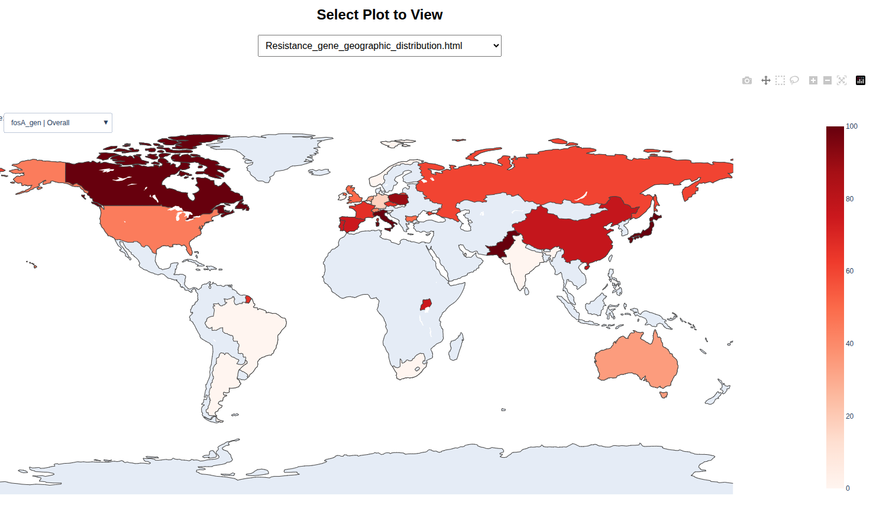
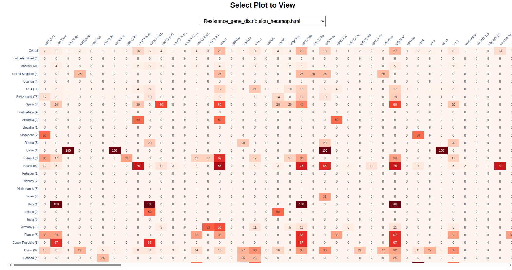
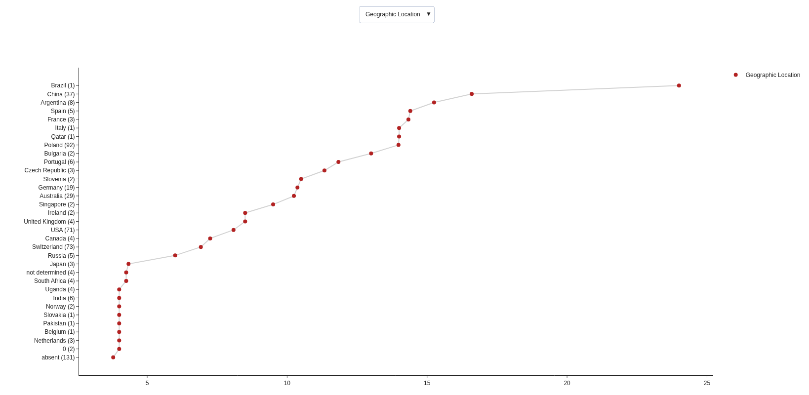
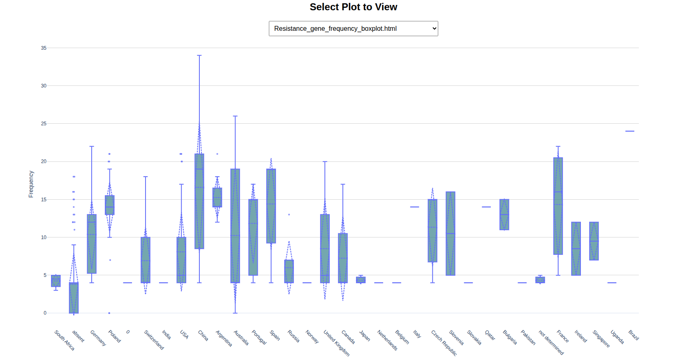
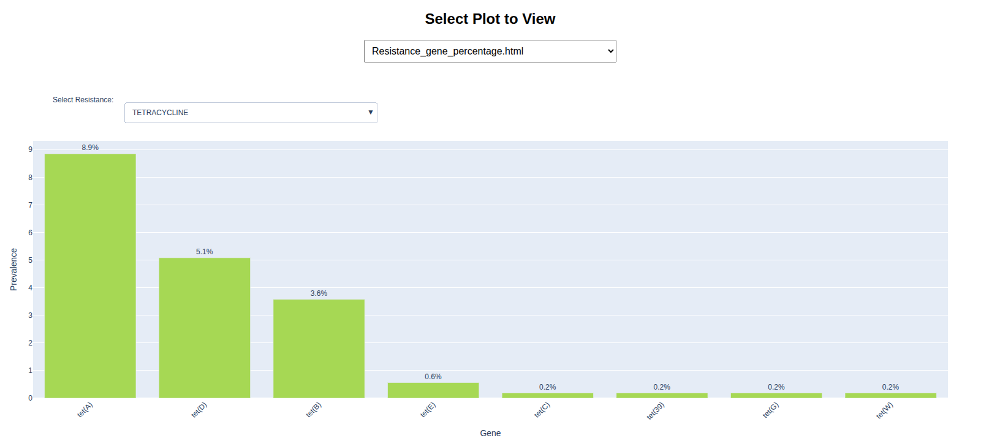
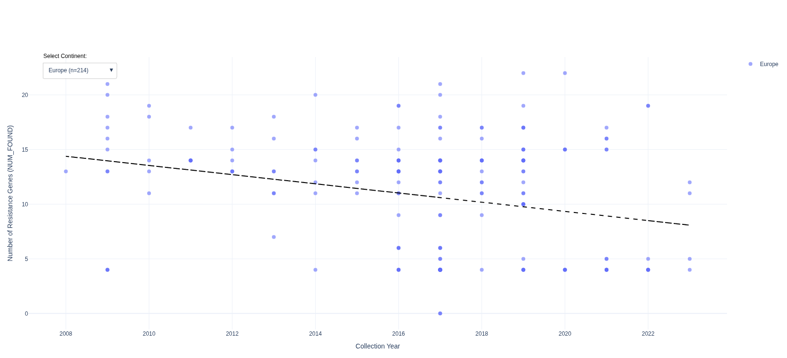

# PanResistome: Scalable Pipeline for Global Antimicrobial Resistance Analysis

Current pipeline version: `0.6.0`

## Overview

**PanResistome** is a scalable, modular, and reproducible bioinformatics pipeline built using [Nextflow](https://www.nextflow.io/). It automates the end-to-end analysis of global antimicrobial resistance (AMR) patterns in bacterial populations using genome assemblies. The pipeline is designed for researchers working in microbial genomics, resistome surveillance, and public health, enabling large-scale comparative analysis of resistance gene profiles across time and geography.

PanResistome integrates several state-of-the-art tools including:

* [**FetchM2**](https://github.com/Tasnimul-Arabi-Anik/FetchM2): for standardized genome metadata, host/source/environment normalization, metadata audit reports, and download-ready assembly tables
* [**CheckM2**](https://github.com/chklovski/CheckM2): for genome completeness and contamination quality assessment
* [**GTDB-Tk**](https://github.com/Ecogenomics/GTDBTk): for taxonomy classification and genus/species consistency checks
* [**QUAST**](https://github.com/ablab/quast): for assembly structure metrics such as N50, contig count, GC, and total length
* [**FastANI/skani**](https://github.com/ParBLiSS/FastANI): for pairwise ANI, species-consistency screening, and near-duplicate clustering
* [**Mash**](https://github.com/marbl/Mash): for optional fast sketch-based distance pre-screening
* [**ABRicate**](https://github.com/tseemann/abricate): for AMR, virulence, and plasmid database annotation through the PanR2 comprehensive mode
* [**NCBI AMRFinderPlus**](https://github.com/ncbi/amr): optional first-class AMR gene/protein screening with PanR2-compatible feature export
* [**MobileElementFinder**](https://bitbucket.org/genomicepidemiology/mobileelementfinder): optional mobile genetic element annotation when explicitly enabled
* [**IntegronFinder**](https://github.com/gem-pasteur/Integron_Finder): for integron annotation in comprehensive mode
* [**MLST**](https://github.com/tseemann/mlst): for sequence-type context in comprehensive mode
* [**MOB-suite**](https://github.com/phac-nml/mob-suite): optional plasmid reconstruction/typing before PanR2 analysis
* [**geNomad**](https://github.com/apcamargo/genomad): optional prophage/viral-region annotation when a geNomad database is provided
* **Organism-specific typing modules**: optional Kleborate/Kaptive/ECTyper table generation or ingestion for organism-focused comparative genomics
* [**PanR2**](https://github.com/Tasnimul-Arabi-Anik/PanR2): for downstream statistical analysis, cross-database associations, reports, and interactive visualization

## Key Features

* 🔄 **Fully automated** end-to-end pipeline from genome download to visualization
* 🧬 **Panresistome analysis** using resistance gene profiling from ABRicate
* 🧫 **Comprehensive feature mode** for NCBI AMR, VFDB, PlasmidFinder, IntegronFinder, MLST, optional MobileElementFinder, optional MOB-suite, prophage/geNomad, and organism-specific typing tables through PanR2
* 📊 **Visualization-ready outputs** including heatmaps, barplots, boxplots, and interactive HTML figures
* 📈 **Statistical summaries** and correlation-based insights on resistance gene distribution
* 🌍 **Geospatial & temporal comparison** of AMR gene prevalence
* 💡 **Epidemic signal detection** by comparing ARG prevalence across time and location
* ⚙️ **Nextflow-based** for reproducibility, scalability, and cloud/HPC compatibility
* 🧾 **PanR2 handoff exports** so heavy tool execution stays in PanResistome while PanR2 stays lightweight

---

## Workflow Overview

```
+-------------+   +-------------+   +----------------------+   +----------------------+   +-------+
|   FetchM2   |-->| Sequence QC |-->| CheckM2/QUAST/ANI/QC |-->| PanR2 comprehensive  |-->| Report|
+-------------+   +-------------+   +----------------------+   +----------------------+   +-------+
| Assemblies  |   | Assembly    |   | Heavy comparative    |   | ABRicate databases, |   | plots |
| & metadata  |   | stats       |   | genomics + filtering |   | MGE, integron, MLST |   | HTML  |
+-------------+   +-------------+   +----------------------+   +----------------------+   +-------+

Optional: add `--run_gtdbtk true`, `--run_quast true`, `--run_ani true`, or `--run_mash true` to insert heavier comparative-genomics checks before ABRicate and PanR2.
```

Each run also writes Conda environment version reports under `pipeline_versions/` so analyses can be traced back to the exact tool versions used. Completed runs also write compact runtime/resource summaries from the Nextflow trace:

```text
pipeline_runtime_summary.tsv
pipeline_runtime_tasks.tsv
```

PanR2 handoff exports also write machine-readable reproducibility and schema
manifests under `panr2_inputs/manifest/`:

```text
reproducibility_manifest.json
feature_contract.json
```

Sequence QC filtering is optional. By default, the pipeline reports QC metrics but keeps all assemblies for downstream analysis. Add `--qc_filter true` with one or more thresholds to exclude failed assemblies from ABRicate, PanR2, and later tools.

CheckM2 is enabled by default. If `--checkm2_db` is not provided, PanResistome attempts to download the CheckM2 database automatically under `<outdir>/databases/checkm2` unless `--checkm2_auto_download_db false` is set. The CheckM2 environment is pinned to the CheckM2 1.1.0 build that can load the packaged `.keras` model with CPU TensorFlow 2.17; the image build and version-capture step now smoke-test that model load instead of only checking `command -v checkm2`. The database is large, so users on restricted networks can still pre-download it and pass `--checkm2_db /path/to/checkm2_database.dmnd`.

For a lighter validation run on modest hardware, use `--stop_after_qc true`. This runs FetchM2 metadata processing, sequence QC, and CheckM2, then collects QC outputs without running GTDB-Tk, ABRicate, or PanR2.

GTDB-Tk is disabled by default because it is resource-intensive. If enabled, it requires its reference data to be available in the run environment. If `GTDBTK_DATA_PATH` is not configured globally, pass the location with `--gtdbtk_data_path /path/to/gtdbtk_data`. Taxonomy matching compares GTDB-Tk classification against the organism/species metadata at genus rank by default; use `--taxonomy_match_rank species` for stricter matching.

QUAST, FastANI/skani, and Mash are also optional. They are part of PanResistome because they require external tools and can be expensive on large genome sets. Their outputs are summarized into standardized tables and exported under `panr2_inputs/` for PanR2 to analyze without inheriting the heavy dependencies.

Pairwise modules require at least two genomes after any QC filtering. If ANI or Mash is enabled but only one genome remains, PanResistome skips that module as `SKIPPED_INAPPLICABLE`, writes the usual status/empty summary files, and continues. This is not a biological warning; it means the selected dataset is not pairwise-comparable.

For the broader database/tool workflow, choose an analysis profile with `--analysis_profile comprehensive`. By default, PanResistome now runs the standard feature runners first through `--panr2_native_feature_runners true`: ABRicate `ncbi`, `vfdb`, and `plasmidfinder`, plus IntegronFinder and MLST, are executed under PanResistome ownership and passed to PanR2 as precomputed directories. This keeps PanR2 focused on standardized analysis/reporting while preserving the same public comprehensive command. PanResistome runs ABRicate database setup and force-refreshes the requested ABRicate databases by default; use `--panr2_update_abricate_db false` for offline, cached, or fully frozen-database reruns. MobileElementFinder is available with `--panr2_run_mobileelementfinder true`, but is opt-in because its upstream JSON parser can fail on some valid assemblies. The workflow also writes PanR2 database-specific folders, cross-database associations, temporal summaries, a top-level dashboard at `report/index.html`, citations, software versions, a database/tool setup report at `panr2_inputs/manifest/database_setup_status.tsv`, the ABRicate setup action report at `panr2_inputs/manifest/abricate_database_setup_status.tsv`, and a standardized `panr2_inputs/` handoff bundle.

ISfinder is handled separately from ABRicate. The ISfinder database terms do not permit automatic database download or redistribution without written authorization, so PanResistome provides an ISfinder-compatible BLAST runner that builds a local BLAST database from an authorized FASTA supplied with `--isfinder_db_fasta`. When enabled with `--run_isfinder true`, the module writes PanR2-readable tables under `isfinder/tables/` and PanR2 receives them through `--isfinder-dir`.

DefenseFinder remains available as `--panr2_run_defensefinder true`, but it is not part of the default comprehensive mode until its Conda dependency stack is stable across fresh installs. GTDB-Tk remains off by default because it requires a large external reference database.

Optional heavy modules can be inserted before PanR2:

```bash
--run_amrfinderplus true
--run_mobsuite true
--run_genomad true --genomad_db /path/to/genomad_db
--run_kleborate true
--run_ectyper true
--run_kaptive true --kaptive_db /path/to/kaptive_db
```

The same feature families can also be supplied as precomputed tables without running the external tools inside PanResistome:

```bash
--mobsuite_dir /path/to/mobsuite_tables
--amrfinderplus_dir /path/to/amrfinderplus_tables
--defensefinder_dir /path/to/defensefinder_tables
--prophage_dir /path/to/prophage_tables
--kleborate_dir /path/to/kleborate_tables
--kaptive_dir /path/to/kaptive_tables
--ectyper_dir /path/to/ectyper_tables
--serotypefinder_dir /path/to/serotypefinder_tables
--sccmecfinder_dir /path/to/sccmecfinder_tables
```

This table-input path is the preferred stable route for organism-specific typing and CGE outputs until their database setup is reproducible across fresh machines. SerotypeFinder and SCCmecFinder are currently supported as PanR2-compatible table inputs; their CGE database-driven runners are intentionally kept outside the default environment.

Database setup automation is documented in [`docs/database_automation_matrix.md`](docs/database_automation_matrix.md). In short: PanResistome automatically handles FetchM2 downloads, CheckM2 database download, ABRicate setup/refresh, AMRFinderPlus database update when enabled, and tool-bundled resources such as MLST schemes. MOB-suite and geNomad remain opt-in, but now have cache/download helpers when explicitly enabled. ISfinder and GTDB-Tk intentionally require user-supplied database paths; Kaptive, DefenseFinder, and CGE-style typing runners remain opt-in until each database setup path is validated on fresh machines.

For large runs, add `--large_dataset true` or combine a resource profile with `large`, for example `-profile conda,mamba,desktop_parallel,large`. Large-dataset mode still writes complete feature TSV outputs, but caps report-facing matrices/co-occurrence/proximity summaries, switches the handoff pages to compact mode, summarizes top features per database, and records the applied limits in `panr2_inputs/manifest/report_controls.tsv`. Complete proximity evidence is preserved separately as `panr2_inputs/cross_database/feature_proximity_all.tsv`.

Use `--output_mode basic|important|all` to control the final user-facing bundle. The default is `all`, preserving the complete advanced output tree. `basic` is intentionally minimal: the final sample directory contains only `basic/enriched_genome_dataset.csv` and `basic/enriched_genome_dataset.tsv`, one row per genome with metadata, QC summaries, annotation burdens, compact annotation lists, lineage labels, and module provenance. `important` publishes the enriched dataset plus `important/results.html`, a curated report with Featured Results, Run Overview, QC Summary, Prevalence, Geographic Distribution, Variations, Temporal Trends, Co-occurrence / Genomic Context, Metadata Associations, Lineage / Clonal Structure, Warnings, and Important Files sections; it includes portable PNG/SVG/PDF/TSV figure outputs, key tables, an interactive prevalence viewer with database/metric/top-N/sort/filter controls, an interactive geographic viewer with database/feature/burden/geographic-level/metric/minimum-group-size controls, an interactive variation viewer with database/metric/top-N/sort controls, an interactive temporal trend viewer with database/trend/support/feature controls, an interactive co-occurrence/context viewer with database/support/effect controls, an interactive metadata-association viewer with database/group/significance/effect/display/support controls, an interactive lineage viewer with MLST ST/ANI cluster/BioProject/combined-lineage controls, and links to the complete `panr2_inputs/` handoff bundle.

For 300+ genome desktop validations, start with CheckM2, ANI, and AMRFinderPlus disabled, then add those heavier stages intentionally. The documented 300-record Klebsiella large-mode run used `--run_checkm2 false --run_ani false --run_amrfinderplus false` and still validated FetchM2, sequence QC, QUAST, Mash, ABRicate AMR/VFDB/PlasmidFinder, IntegronFinder, MLST, PanR2 feature contracts, and compact report safeguards. FastANI all-vs-all and AMRFinderPlus nucleotide `tblastn` were the observed long-running optional stages at this scale. If ANI is enabled with `--large_dataset true`, the default `--ani_large_run_strategy auto` skips all-vs-all ANI above `--ani_max_all_vs_all_genomes` and writes an ANI status audit instead of accidentally launching a long all-vs-all run.

### Recommended Analysis Profiles

Use profiles for simple public-facing commands, and use individual flags when you need fine control.

| Profile | What it enables | Intended use |
| --- | --- | --- |
| `qc_only` | FetchM2, sequence QC, CheckM2, optional QC modules, then stop | Fast metadata/QC validation |
| `amr_basic` | PanR2 ABRicate `ncbi` only | Minimal AMR screening |
| `amr_vp` | PanR2 ABRicate `ncbi,vfdb,plasmidfinder` | AMR + virulence + plasmid overview |
| `amr_vp_mge` | `amr_vp` plus ISFinder when an authorized FASTA is supplied, IntegronFinder, and optional MobileElementFinder | AMR with mobile-context analysis |
| `comprehensive` | `amr_vp_mge` plus MLST | Current full default analysis layer |
| `custom` | Only explicitly supplied flags | Development or advanced runs |

Example:

```bash
nextflow run main.nf \
  --input test_small.tsv \
  --outdir results_comprehensive \
  -profile conda,mamba \
  --analysis_profile comprehensive \
  --run_gtdbtk false \
  --qc_filter true \
  --threads 8
```

Recommended public comprehensive command for a fresh user:

```bash
nextflow run main.nf \
  --taxon "Acinetobacter pittii" \
  --organism_max_records 10 \
  --outdir validation_runs/acinetobacter_pittii_10_conda \
  -profile conda,mamba \
  --analysis_profile comprehensive \
  --qc_filter true \
  --run_gtdbtk false \
  --run_checkm2 true \
  --run_quast true \
  --run_ani true \
  --run_mash true \
  --run_amrfinderplus true \
  --run_genomad true \
  --genomad_jobs 1 \
  --genomad_threads_per_sample 1 \
  --genomad_splits 8 \
  --genomad_sensitivity 3.0 \
  --panr2_run_mobileelementfinder false \
  --panr2_run_defensefinder false \
  --threads 8 \
  --checkm2_threads 4 \
  --fetchm2_download_workers 2
```

This command intentionally does not require a local CheckM2 database path, manual AMRFinderPlus database setup, manual ABRicate database setup, GTDB-Tk, MobileElementFinder, DefenseFinder, or ISfinder. ABRicate databases are installed, force-refreshed, and verified automatically by default; add `--panr2_update_abricate_db false` when you want to reuse a cached ABRicate database without refreshing it. The run should write the main dashboard to `<outdir>/<organism>/report/index.html`, the setup audit to `<outdir>/<organism>/panr2_inputs/manifest/database_setup_status.tsv`, and the ABRicate setup action report to `<outdir>/<organism>/panr2_inputs/manifest/abricate_database_setup_status.tsv`.

After the run finishes, validate the core outputs:

```bash
python scripts/check_comprehensive_validation_outputs.py \
  --run-dir validation_runs/acinetobacter_pittii_10_conda \
  --require-checkm2 \
  --require-genomad \
  --expect-zero-schema-errors
```

For desktop-scale validation with parallel native feature runners, use the resource profile instead of manually tuning every thread option:

```bash
nextflow run main.nf \
  --input validation/klebsiella_pneumoniae_100/ncbi_dataset.tsv \
  --outdir validation_runs/klebsiella_pneumoniae_parallel \
  -profile conda,mamba,desktop_parallel \
  --analysis_profile comprehensive \
  --qc_filter true \
  --run_gtdbtk false \
  --run_quast true \
  --run_ani true \
  --run_mash true \
  --run_amrfinderplus true
```

Experimental container profiles are available for deployment testing. The Docker
route now has local-image and GHCR-image biological validation, including a
two-genome run, a geNomad database/download runner test, and a 100-record
Klebsiella large-mode run with clean PanR2 feature-contract output. A 5-genome
Acinetobacter Docker/GHCR comprehensive run also passed with CheckM2 automatic
database download, 5/5 combined QC PASS calls, 630 PanR2 feature rows, and zero
unmatched, invalid, or duplicate feature rows. Singularity
CE has also validated the GHCR image on two-genome geNomad-enabled and
100-record large-mode biological workflows. The main deployment caveat is the
large first GHCR pull or GHCR-to-SIF conversion; use a persistent
`NXF_SINGULARITY_CACHEDIR` on HPC.

```bash
python scripts/check_container_readiness.py \
  --runtime apptainer \
  --image docker://ghcr.io/tasnimul-arabi-anik/panresistome:experimental \
  --database-paths /path/to/checkm2,/path/to/genomad \
  --out container_readiness.tsv

# Add --pull-test to verify that the runtime can pull and execute the image.
# For first-time Singularity/Apptainer conversion of the large all-in-one image,
# use --pull-test-timeout 7200 or another site-appropriate timeout.

nextflow run main.nf \
  --taxon "Acinetobacter pittii" \
  --organism_max_records 10 \
  --outdir validation_runs/acinetobacter_pittii_10_docker \
  -profile docker \
  --container_image ghcr.io/tasnimul-arabi-anik/panresistome:experimental \
  --analysis_profile comprehensive \
  --qc_filter true \
  --run_gtdbtk false \
  --run_checkm2 true \
  --run_quast true \
  --run_ani true \
  --run_mash true \
  --run_amrfinderplus true \
  --run_genomad true \
  --genomad_jobs 1 \
  --genomad_threads_per_sample 1 \
  --genomad_splits 8 \
  --genomad_sensitivity 3.0 \
  --panr2_native_feature_runners true \
  --panr2_native_feature_runner_mode parallel \
  --panr2_run_mobileelementfinder false \
  --panr2_run_defensefinder false \
  --threads 8 \
  --checkm2_threads 4 \
  --fetchm2_download_workers 2
```

For a first desktop-scale Docker run, keep GTDB-Tk, DefenseFinder, MobileElementFinder, and ISfinder off. GTDB-Tk and ISfinder still require user-supplied databases; DefenseFinder remains table-input/experimental; MobileElementFinder is validated as opt-in/nonblocking only after its own organism-specific pass.

The experimental image definition is in [`containers/Dockerfile`](containers/Dockerfile),
and the GHCR build workflow is in [`.github/workflows/container.yml`](.github/workflows/container.yml).

The Docker image is large. For the shortest user-facing container instructions,
see [`docs/docker_quickstart.md`](docs/docker_quickstart.md). For full
deployment evidence, see [`validation/deployment/DOCKER_REMOTE_USER_VALIDATION_RESULTS.md`](validation/deployment/DOCKER_REMOTE_USER_VALIDATION_RESULTS.md).
For the 100-record GHCR Docker scale validation, see [`validation/deployment/GHCR_DOCKER_100_VALIDATION_RESULTS.md`](validation/deployment/GHCR_DOCKER_100_VALIDATION_RESULTS.md).
For the current Acinetobacter CheckM2-on validation target and the 2026-05-16
CheckM2 packaging status, see
[`validation/deployment/ACINETOBACTER_CHECKM2_VALIDATION_STATUS.md`](validation/deployment/ACINETOBACTER_CHECKM2_VALIDATION_STATUS.md).

`desktop_parallel` sets `--threads 16`, `--checkm2_threads 2`, `--fetchm2_download_workers 2`, and `--panr2_native_feature_runner_mode parallel`. Use `lowmem` for smaller machines and `workstation` when additional RAM is available.

Fresh-clone validation of this command on 2026-05-08 completed all 19 Nextflow processes on 45 current `Delftia tsuruhatensis` assemblies, including CheckM2 database auto-download, AMRFinderPlus database auto-update, ABRicate `ncbi/vfdb/plasmidfinder` setup verification, comprehensive PanR2 analysis, and PanR2 handoff export. See [`validation/delftia_tsuruhatensis_current/FRESH_CLONE_VALIDATION_RESULTS.md`](validation/delftia_tsuruhatensis_current/FRESH_CLONE_VALIDATION_RESULTS.md).

For the fresh-user validation path, see [`docs/remote_user_validation.md`](docs/remote_user_validation.md). For the 20 release gates used to judge whether the public comprehensive workflow is reliable, see [`docs/release_reliability_checklist.md`](docs/release_reliability_checklist.md).

For validation status, see [`docs/validation_matrix.md`](docs/validation_matrix.md), [`docs/release_checklist_v0.6.0.md`](docs/release_checklist_v0.6.0.md), [`docs/troubleshooting.md`](docs/troubleshooting.md), and [`docs/example_klebsiella_interpretation.md`](docs/example_klebsiella_interpretation.md). For v0.4.0 large-dataset and deployment evidence, see [`docs/roadmap_v0.4.0.md`](docs/roadmap_v0.4.0.md), [`validation/klebsiella_pneumoniae_300/LARGE_MODE_CHECKM2_OFF_VALIDATION_RESULTS.md`](validation/klebsiella_pneumoniae_300/LARGE_MODE_CHECKM2_OFF_VALIDATION_RESULTS.md), [`docs/hpc.md`](docs/hpc.md), [`docs/containers.md`](docs/containers.md), [`docs/docker_quickstart.md`](docs/docker_quickstart.md), [`validation/deployment/DOCKER_REMOTE_USER_VALIDATION_RESULTS.md`](validation/deployment/DOCKER_REMOTE_USER_VALIDATION_RESULTS.md), and [`validation/deployment/GHCR_DOCKER_100_VALIDATION_RESULTS.md`](validation/deployment/GHCR_DOCKER_100_VALIDATION_RESULTS.md). For v0.5.0 release evidence around reproducibility, schema governance, lineage-aware interpretation, diversity summaries, statistical summaries, and compact Docker/GHCR biological validation, see [`docs/roadmap_v0.5.0.md`](docs/roadmap_v0.5.0.md) and [`validation/klebsiella_pneumoniae_10/V0_5_0_DOCKER_VALIDATION_RESULTS.md`](validation/klebsiella_pneumoniae_10/V0_5_0_DOCKER_VALIDATION_RESULTS.md). For v0.6.0 release evidence around ANI-enabled Singularity/GHCR lineage validation, positive IntegronFinder handoff preservation, and the native-handoff export fix, see [`docs/roadmap_v0.6.0.md`](docs/roadmap_v0.6.0.md), [`validation/klebsiella_pneumoniae_10/ANI_LINEAGE_SINGULARITY_VALIDATION_RESULTS.md`](validation/klebsiella_pneumoniae_10/ANI_LINEAGE_SINGULARITY_VALIDATION_RESULTS.md), and [`validation/integronfinder_positive/VALIDATION_RESULTS.md`](validation/integronfinder_positive/VALIDATION_RESULTS.md). For optional module runner/table-input status, see [`docs/optional_module_validation_matrix.md`](docs/optional_module_validation_matrix.md), [`validation/optional_feature_analysis/VALIDATION_RESULTS.md`](validation/optional_feature_analysis/VALIDATION_RESULTS.md), [`validation/optional_runner_smoke/OPTIONAL_RUNNER_SMOKE_RESULTS.md`](validation/optional_runner_smoke/OPTIONAL_RUNNER_SMOKE_RESULTS.md), [`validation/optional_runner_biological/KLEBSIELLA_2_OPTIONAL_RUNNER_RESULTS.md`](validation/optional_runner_biological/KLEBSIELLA_2_OPTIONAL_RUNNER_RESULTS.md), [`validation/optional_runner_biological/KLEBSIELLA_100_MOBSUITE_KLEBORATE_RESULTS.md`](validation/optional_runner_biological/KLEBSIELLA_100_MOBSUITE_KLEBORATE_RESULTS.md), and [`validation/optional_runner_biological/GENOMAD_POSITIVE_CALL_VALIDATION_RESULTS.md`](validation/optional_runner_biological/GENOMAD_POSITIVE_CALL_VALIDATION_RESULTS.md).

### Module Stability

| Module | Status | Default | Tested route | Notes |
| --- | --- | --- | --- | --- |
| FetchM2 metadata/download | Stable | Yes | Local and remote-style runs | Default metadata engine |
| Sequence QC | Stable | Yes | CI + validation runs | `seqkit` with Python fixture fallback |
| CheckM2 | Core, Conda and Docker/GHCR fixture smokes plus 5-genome Acinetobacter Docker/GHCR comprehensive pass | Yes | Historical remote-style run with auto DB; 2026-05-16 stale TensorFlow/Keras failure reproduced, then fixed package route loaded the model and produced real `quality_report.tsv` rows in Conda and Docker; Acinetobacter Docker/GHCR comprehensive run produced 5/5 CheckM2 rows | Large DB can be auto-downloaded or supplied; failure is now strict and actionable when `--run_checkm2 true` |
| GTDB-Tk | Stable but heavy | No | Partial | Requires external reference data |
| QUAST | Stable optional | No | Remote-style run | Assembly structure QC |
| FastANI/skani | Stable optional | No | Remote-style FastANI run | ANI, outliers, duplicates |
| Mash | Stable optional | No | Remote-style run | Fast pre-screen only |
| ABRicate NCBI/VFDB/PlasmidFinder | Stable in PanResistome-native comprehensive mode | No | Remote-style + native-runner validation | Main default annotation path |
| AMRFinderPlus | Stable optional | No | Remote-style Delftia run | Auto-fetches the AMRFinderPlus database by default and exports PanR2 feature tables |
| MobileElementFinder | Active development, opt-in | No | Real-data parser failure observed | Use `--panr2_run_mobileelementfinder true` when needed; upstream JSON parser can fail on some assemblies |
| IntegronFinder/MLST | Active development | No | Native-runner validation | Run by PanResistome native feature-runner stage by default, then passed to PanR2; MLST can be header-only for unsupported organisms |
| MOB-suite/geNomad/typing tools | Experimental runners, stable table passthrough | No | Synthetic PanR2 contract export path | Prefer precomputed tables for difficult DB setups; see the optional module validation matrix |
| Database/tool preflight audit | Stable | Comprehensive profile | Unit test + comprehensive path | Writes `panr2_inputs/manifest/database_setup_status.tsv` and fails required missing databases/tools |
| Native runner merge audit | Stable | Native feature runners | Delftia/Klebsiella validation | Writes `panr2_inputs/manifest/native_runner_merge_audit.tsv` with expected vs observed raw table counts |

---

## 🚀 Getting Started

### ✅ Prerequisites

* [Nextflow](https://www.nextflow.io/)
* [Conda](https://docs.conda.io/en/latest/)
* [Mamba](https://mamba.readthedocs.io/) is strongly recommended for optional heavy-tool environments
* Git

### 🔧 Installation

```bash
git clone https://github.com/Tasnimul-Arabi-Anik/PanResistome.git
cd PanResistome
```

### ✅ Preflight Setup

Run the bootstrap script before launching a long analysis. It checks Java, Nextflow, Conda, environment files, ABRicate database files, CheckM2 database path, and Nextflow syntax.

If you already have the CheckM2 database:

```bash
scripts/bootstrap.sh \
  --checkm2-db /path/to/CheckM2_database/uniref100.KO.1.dmnd \
  --abricate-db ./db
```

To download the CheckM2 database:

```bash
scripts/bootstrap.sh \
  --download-checkm2-db "$HOME/databases" \
  --abricate-db ./db
```

The script prints ready-to-run validation and full pipeline commands using the checked paths.

For the most practical fresh-install experience, use `-profile conda,mamba` when mamba is available. Plain `-profile conda` remains supported, but optional heavy environments such as MOB-suite, geNomad, Kleborate, Kaptive, and ECTyper can solve slowly with classic conda on some systems.

### 🧪 Offline CI Test

The repository includes tiny local fixtures for syntax-safe CI and development checks. This profile does not download from NCBI and does not require CheckM2, ABRicate, PanR2, or GTDB-Tk databases.

```bash
nextflow run main.nf -profile test
```

It validates sequence QC, metadata enrichment, pass-only metadata generation, and result collection using `tests/fixtures/local_samples/`.

### Delftia Validation And Example HTML

The repository includes a reproducible current NCBI Assembly input for `Delftia tsuruhatensis` under:

```text
validation/delftia_tsuruhatensis_current/ncbi_dataset.tsv
```

It was generated from NCBI Assembly E-utilities with:

```bash
python scripts/generate_ncbi_assembly_input.py \
  --organism "Delftia tsuruhatensis" \
  --outdir validation/delftia_tsuruhatensis_current
```

A comprehensive run writes the main combined HTML dashboard here:

```text
validation_runs/delftia_current/<organism>/report/index.html
```

The validation results and lightweight output summary are documented here:

```text
validation/delftia_tsuruhatensis_current/VALIDATION_RESULTS.md
docs/example_outputs/delftia_summary/README.md
```

The full run directory can be large, so the preferred GitHub pattern is to keep the reproducible input and command in git, then publish a trimmed `report/` or GitHub Pages snapshot after manual validation rather than committing genomes, raw databases, and all intermediate outputs.

## Input
Provide either an Assembly TSV with `--input` or let PanResistome generate one
from an NCBI taxon query with `--taxon`.

```bash
nextflow run main.nf \
  --taxon "Acinetobacter pittii" \
  --organism_max_records 100 \
  --organism_candidate_records 500 \
  --organism_diverse_bioproject true \
  --outdir validation_runs/acinetobacter_pittii \
  -profile conda,mamba,desktop_parallel \
  --analysis_profile comprehensive \
  --run_gtdbtk false
```

When `--taxon` is used, PanResistome writes the generated input bundle to
`<outdir>/input_generation/` and then passes `ncbi_dataset.tsv` into FetchM2.
This is equivalent to running `scripts/generate_ncbi_assembly_input.py` first,
but removes that manual step for remote users.

`--organism` remains accepted as a backward-compatible alias for `--taxon`.

You can still download or prepare `ncbi_dataset.tsv` yourself from the
[NCBI genome database](https://www.ncbi.nlm.nih.gov/datasets/genome/) and pass
it with `--input`.

## 🧪 Running the Pipeline

First validate the download and QC path:

```bash
nextflow run main.nf \
  --input test_small.tsv \
  --outdir results_small \
  -profile conda \
  --stop_after_qc true \
  --run_gtdbtk false \
  --threads 8 \
  --checkm2_db /path/to/CheckM2_database/uniref100.KO.1.dmnd
```

Then run the downstream analysis with QC filtering:

```bash
nextflow run main.nf \
  --input test_small.tsv \
  --outdir results_small \
  -profile conda \
  --run_gtdbtk false \
  --qc_filter true \
  --threads 8 \
  --checkm2_db /path/to/CheckM2_database/uniref100.KO.1.dmnd

```

## 📦 Repository Structure

```
PanResistome/
├── main.nf
├── nextflow.config
├── envs/
│   ├── fetchm.yaml
│   └── abricate.yml
├── results/
├── figures/ 
├── LICENSE
├── test.tsv
└── README.md
```

---

## 🧾 Command-line Options

### ✅ Required Arguments

| Argument   | Description                              |
| ---------- | ---------------------------------------- |
| `--input`  | Input TSV file listing genome accessions. Not required when `--taxon` or `--organism` is supplied. |
| `--taxon` | NCBI Assembly taxon query used to generate the FetchM2 input TSV internally. |
| `--organism` | Backward-compatible alias for `--taxon`. |
| `--outdir` | Output directory for results             |

### ⚙️ Optional Arguments for FetchM2

| Argument    | Type   | Default | Description                                           |
| ----------- | ------ | ------- | ----------------------------------------------------- |
| `--checkm`  | float  | -       | Minimum CheckM completeness threshold (e.g., 90)      |
| `--ani`     | str    | all     | ANI filter status: OK, Inconclusive, Failed, or all   |
| `--sleep`   | float  | 0.5     | Time to wait between fetch requests (in seconds)      |
| `--metadata_engine` | str | fetchm2 | Metadata engine: `fetchm2` or reversible legacy `legacy_fetchm` |
| `--fetchm2_offline` | bool | false | Use FetchM2 offline metadata mode |
| `--fetchm2_no_analysis` | bool | false | Skip FetchM2 metadata analysis figures/tables |
| `--fetchm2_download` | bool | true | Download selected assemblies from FetchM2 metadata |
| `--fetchm2_download_engine` | str | native | Sequence downloader: `native` uses `fetchm2 seq`; `panresistome` uses the fallback downloader |
| `--fetchm2_workers` | int | 3 | FetchM2 BioSample metadata workers |
| `--fetchm2_download_workers` | int | 1 | Sequence-download workers; increase cautiously for larger runs |
| `--fetchm2_max_genomes` | int | - | Maximum genomes selected for sequence download after metadata filtering |
| `--fetchm2_keep_assembly_duplicates` | bool | false | Keep paired GCA/GCF assembly rows in `fetchm2_clean.csv`; by default FetchM2 keeps one representative row per Assembly Name |
| `--organism_max_records` | int | 0 | Maximum NCBI Assembly records written when `--taxon`/`--organism` is used; `0` writes all records returned by the query |
| `--organism_candidate_records` | int | 0 | Candidate Assembly records fetched before BioProject-diverse selection; use a larger value such as `500` when selecting 100 genomes |
| `--organism_diverse_bioproject` | bool | true | Round-robin select records across BioProjects when `--organism_max_records` is set |
| `--organism_prefer_refseq` | bool | true | Keep RefSeq/GCF accessions sorted first during generated input selection |
| `--host`    | str\[] | -       | Host species (e.g., "Homo sapiens", "Bos taurus")     |
| `--year`    | str\[] | -       | Filter by year or range (e.g., "2015" or "2015-2023") |
| `--country` | str\[] | -       | Filter by country (e.g., "Bangladesh", "USA")         |
| `--cont`    | str\[] | -       | Filter by continent (e.g., "Asia", "Africa")          |
| `--subcont` | str\[] | -       | Filter by subcontinent (e.g., "Southern Asia")        |
| `--sample_type` | str\[] | - | FetchM2 `Sample_Type_SD` filter |
| `--isolation_source` | str\[] | - | FetchM2 `Isolation_Source_SD` filter |
| `--environment_medium` | str\[] | - | FetchM2 `Environment_Medium_SD` filter |
| `--year_from` | int | - | Minimum FetchM2 `Collection_Year` |
| `--year_to` | int | - | Maximum FetchM2 `Collection_Year` |

### 🧬 Optional Arguments for PanR2

| Argument   | Type  | Default | Description                                                |
| ---------- | ----- | ------- | ---------------------------------------------------------- |
| `--genep`  | float | -       | Minimum % gene presence to include in heatmaps             |
| `--nseq`   | int   | -       | Minimum number of sequences required per group in heatmaps |
| `--format` | str   | png     | Output format for figures (tiff, svg, png, pdf)            |

### 🧪 Optional Arguments for Sequence QC Filtering

| Argument                | Type  | Default | Description                                      |
| ----------------------- | ----- | ------- | ------------------------------------------------ |
| `--qc_filter`           | bool  | false   | Use only QC-passing assemblies downstream        |
| `--min_total_length`    | int   | -       | Minimum assembly length required to pass QC      |
| `--max_contigs`         | int   | -       | Maximum contig count allowed to pass QC          |
| `--min_n50`             | int   | -       | Minimum N50 required to pass QC                  |
| `--min_gc`              | float | -       | Minimum GC percentage allowed to pass QC         |
| `--max_gc`              | float | -       | Maximum GC percentage allowed to pass QC         |
| `--max_ambiguous_bases` | int   | -       | Maximum ambiguous/gap bases allowed to pass QC   |
| `--checkm2_db`          | path  | -       | Optional CheckM2 database path                   |
| `--checkm2_auto_download_db` | bool | true | Download the CheckM2 database automatically when no database path is provided |
| `--checkm2_db_dir`      | path  | `<outdir>/databases/checkm2` | CheckM2 database download/cache directory |
| `--checkm2_threads`     | int   | `min(--threads,4)` | Threads for CheckM2 only; keep low on desktops with limited RAM |
| `--min_completeness`    | float | -       | Minimum CheckM2 completeness required to pass QC |
| `--max_contamination`   | float | -       | Maximum CheckM2 contamination allowed to pass QC |
| `--checkm2_lowmem`      | bool  | true    | Run CheckM2 in low-memory mode                   |
| `--stop_after_qc`       | bool  | false   | Stop after sequence QC and CheckM2               |
| `--run_gtdbtk`          | bool  | false   | Enable GTDB-Tk taxonomy QC                       |
| `--gtdbtk_data_path`    | path  | -       | Optional GTDB-Tk reference data path             |
| `--taxonomy_match_rank` | str   | genus   | Compare expected taxonomy at genus or species    |
| `--run_quast`           | bool  | false   | Enable QUAST assembly-structure QC               |
| `--run_ani`             | bool  | false   | Enable FastANI/skani pairwise ANI analysis       |
| `--ani_tool`            | str   | fastani | ANI engine: `fastani` or `skani`                 |
| `--ani_duplicate_threshold` | float | 99.9 | ANI threshold for near-duplicate clusters        |
| `--ani_species_threshold` | float | 95.0 | ANI warning threshold for species consistency    |
| `--ani_large_run_strategy` | str | auto | ANI strategy for large runs: `auto`, `all`, or `skip`; `auto` skips all-vs-all ANI in large-dataset mode above `--ani_max_all_vs_all_genomes` |
| `--ani_max_all_vs_all_genomes` | int | 200 | Maximum genomes for automatic all-vs-all ANI in large-dataset mode |
| `--run_mash`            | bool  | false   | Enable Mash sketch/distance pre-screening        |
| `--representative_only` | bool  | false   | Keep one representative per near-duplicate ANI cluster when filtering |
| `--analysis_profile`    | str   | custom  | Preset mode: `custom`, `qc_only`, `amr_basic`, `amr_vp`, `amr_vp_mge`, or `comprehensive` |
| `--run_abricate` | bool | true | Run the legacy ABRicate/PanR branch when PanR2 comprehensive mode is disabled; set false for optional-runner/table-input smoke validation |
| `--export_panr2_inputs` | bool  | true    | Export standardized `panr2_inputs/` handoff directory |
| `--run_panr2_comprehensive` | bool | false | Run comprehensive PanR2 analysis; PanResistome runs standard feature runners first by default |
| `--panr2_setup_abricate_db` | bool | true | Run `panr setup-db` before comprehensive analysis |
| `--panr2_update_abricate_db` | bool | true | Force-refresh requested ABRicate databases with `abricate-get_db --force` after setup when available; set false for offline/cached reruns |
| `--panr2_abricate_dbs` | str | ncbi,vfdb,plasmidfinder | ABRicate databases used in comprehensive mode; add `isfinder` only if installed |
| `--panr2_native_feature_runners` | bool | true | Run ABRicate/IntegronFinder/MLST under PanResistome before PanR2, then pass precomputed result directories |
| `--panr2_native_feature_runner_mode` | str | serial | Native feature-runner backend: `serial` or `parallel`; parallel runs each ABRicate database with per-genome workers, then runs per-assembly IntegronFinder/MLST concurrently within the native-runner process |
| `--panr2_run_mobileelementfinder` | bool | false | Run MobileElementFinder in the PanR2 feature-runner layer; opt-in because the upstream parser can fail on some assemblies |
| `--panr2_mobileelementfinder_allow_failure` | bool | true | Keep MobileElementFinder failures nonfatal and write auditable header-only outputs |
| `--run_isfinder` | bool | false | Run PanResistome's ISfinder-compatible BLAST annotator and pass results to PanR2 |
| `--isfinder_db_fasta` | path | - | Authorized local ISfinder nucleotide FASTA used to build the local BLAST database |
| `--isfinder_dir` | path | - | Existing ISfinder-style result directory to pass into PanR2 |
| `--isfinder_min_identity` | float | 90 | Minimum nucleotide identity for ISfinder-compatible BLAST calls |
| `--isfinder_min_coverage` | float | 80 | Minimum reference coverage for ISfinder-compatible BLAST calls |
| `--panr2_run_defensefinder` | bool | false | Add DefenseFinder when a working installation is available |
| `--defensefinder_dir` | path | - | Existing DefenseFinder table directory to pass into PanR2 |
| `--run_amrfinderplus` | bool | false | Run NCBI AMRFinderPlus and export standardized PanR2 feature tables |
| `--amrfinderplus_dir` | path | - | Existing AMRFinderPlus table directory to include in PanR2 contract exports |
| `--amrfinderplus_organism` | str | - | Optional AMRFinderPlus `--organism` value |
| `--amrfinderplus_update_db` | bool | true | Run `amrfinder -u` before AMRFinderPlus execution so fresh installs fetch the AMRFinderPlus database |
| `--amrfinderplus_jobs` | int | `--threads` | Parallel AMRFinderPlus sample jobs |
| `--amrfinderplus_threads_per_sample` | int | 1 | Threads used by each AMRFinderPlus sample job |
| `--amrfinderplus_reuse_existing` | bool | true | Reuse non-empty per-sample AMRFinderPlus TSVs on resumed/interrupted runs |
| `--amrfinderplus_progress_every` | int | 10 | Print AMRFinderPlus progress every N completed sample jobs |
| `--panr2_min_identity` | float | 90 | Minimum identity threshold for PanR2 feature calls |
| `--panr2_plot_style` | str | publication | PanR2 plot preset: `publication`, `dashboard`, or `compact` |
| `--panr2_label_max_length` | int | 40 | Maximum feature label length in crowded plots |
| `--panr2_sample_map` | path | - | Optional `sample_id` to `Assembly Accession` map for external PanR2 table inputs; FetchM2 `sample_map.csv` is used automatically when present |
| `--panr2_cross_database_max_features` | int | 300 | Default feature cap for PanR2 cross-database summaries when large-dataset mode is not enabled |
| `--large_dataset` | bool | false | Enable compact report safeguards for large feature matrices while preserving complete TSV exports |
| `--report_mode` | str | publication | Handoff report density preset: `compact`, `publication`, or `exploratory`; defaults to compact when `--large_dataset true` |
| `--output_mode` | str | all | Final user-facing output bundle: `basic`, `important`, or `all`; `basic` publishes only `basic/enriched_genome_dataset.csv` and `.tsv` |
| `--figure_formats` | str | png,svg,tsv | Requested user-facing figure formats; important report figures write portable HTML, PNG, SVG, plotted TSV, and PDF companions where supported without extra plotting dependencies |
| `--publication_figures` | bool | false | Reserved switch for expanded PDF/publication figure generation in later report phases |
| `--max_features_heatmap` | int | 300 | Maximum features retained in exported presence/absence matrices; defaults to 150 in large-dataset mode |
| `--max_features_network` | int | `--panr2_cross_database_max_features` | Maximum features used for co-occurrence/proximity summaries; defaults to 150 in large-dataset mode |
| `--max_metadata_columns` | int | 80 | Maximum metadata audit rows shown in handoff HTML pages; defaults to 20 in large-dataset mode |
| `--top_n_features_per_database` | int | 25 | Number of top prevalent features per database summarized for report navigation; defaults to 50 in large-dataset mode |
| `--skip_heavy_interactive_plots` | bool | false | Mark heavy interactive plots as skipped/deprioritized in report controls; enabled automatically by large-dataset mode |
| `--core_feature_threshold` | float | 0.95 | Prevalence threshold used to classify core features in PanR2 diversity summaries |
| `--rare_feature_threshold` | float | 0.05 | Prevalence threshold used to classify rare features in PanR2 diversity summaries |
| `--run_mobsuite` | bool | false | Run MOB-suite and pass plasmid reconstruction/typing tables into PanR2 |
| `--mobsuite_dir` | path | - | Existing MOB-suite table directory to pass into PanR2 |
| `--mobsuite_db` | path | - | Existing MOB-suite database directory passed to `mob_recon --database_directory`; for offline/restricted runs it should include core MOB-suite files plus `taxa.sqlite` |
| `--mobsuite_db_dir` | path | `<outdir>/databases/mobsuite` | MOB-suite database cache/init directory when `--mobsuite_db` is not supplied |
| `--mobsuite_auto_init_db` | bool | true | Run `mob_init` for the MOB-suite cache directory when needed |
| `--mobsuite_auto_init_taxa` | bool | true | Initialize MOB-suite ETE `taxa.sqlite` in the cache directory when needed |
| `--mobsuite_jobs` | int | `min(--threads, 8)` | Parallel MOB-suite sample jobs |
| `--mobsuite_threads_per_sample` | int | 1 | Threads used by each MOB-suite sample job |
| `--mobsuite_reuse_existing` | bool | true | Reuse non-empty per-sample MOB-suite outputs on resumed/interrupted runs |
| `--run_genomad` | bool | false | Run geNomad and pass prophage/viral-region tables into PanR2 |
| `--prophage_dir` | path | - | Existing prophage/viral-region table directory to pass into PanR2 |
| `--genomad_db` | path | - | Existing geNomad database directory; if omitted and `--run_genomad true`, PanResistome uses `--genomad_db_dir` |
| `--genomad_db_dir` | path | `<outdir>/databases/genomad` | geNomad database download/cache directory when `--genomad_db` is not supplied |
| `--genomad_auto_download_db` | bool | true | Run `genomad download-database` into `--genomad_db_dir` when `--run_genomad true` and no `--genomad_db` is supplied |
| `--genomad_use_host_env` | bool | false | Use a prebuilt host/container `genomad` executable instead of creating the geNomad Conda env; also available as `-profile genomad_host` |
| `--genomad_splits` | int | geNomad default | Split geNomad/MMseqs searches to reduce memory usage; try `--genomad_splits 8` or higher if MMseqs is killed |
| `--genomad_sensitivity` | float | geNomad default | geNomad/MMseqs marker-search sensitivity; lower values can reduce memory/time at the cost of sensitivity |
| `--genomad_jobs` | int | `min(--threads, 2)` | Parallel geNomad sample jobs inside the `GENOMAD_PROPHAGE` process |
| `--genomad_threads_per_sample` | int | 1 | Threads used by each geNomAD sample job; keep this low when running multiple jobs |
| `--genomad_reuse_existing` | bool | true | Reuse non-empty per-sample geNomad summary outputs on resumed/interrupted runs |
| `--container_image` | path/image | - | Experimental image used by `docker`, `apptainer`, or `singularity` profiles |
| `--container_run_options` | str | - | Extra runtime options passed to Docker/Apptainer/Singularity profiles |
| `--slurm_queue` | str | - | Optional queue/partition name for the experimental `slurm` profile |
| `--slurm_account` | str | - | Optional account/project flag for the experimental `slurm` profile |
| `--slurm_cluster_options` | str | - | Extra site-specific SLURM options for the experimental `slurm` profile |
| `--slurm_queue_size` | int | 50 | Maximum queued tasks for the experimental `slurm` profile |
| `--run_organism_specific_typing` | bool | false | Run available organism-specific typing helpers |
| `--run_kleborate` | bool | false | Run Kleborate when available |
| `--kleborate_dir` | path | - | Existing Kleborate table directory to pass into PanR2 |
| `--kleborate_jobs` | int | `min(--threads, 8)` | Parallel Kleborate sample jobs |
| `--kleborate_reuse_existing` | bool | true | Reuse non-empty per-sample Kleborate outputs on resumed/interrupted runs |
| `--run_kaptive` | bool | false | Run Kaptive when `--kaptive_db` is provided |
| `--kaptive_dir` | path | - | Existing Kaptive table directory to pass into PanR2 |
| `--kaptive_db` | path | - | Kaptive database path |
| `--run_ectyper` | bool | false | Run ECTyper when available |
| `--ectyper_dir` | path | - | Existing ECTyper table directory to pass into PanR2 |
| `--serotypefinder_dir` | path | - | Existing SerotypeFinder table directory to pass into PanR2 |
| `--sccmecfinder_dir` | path | - | Existing SCCmecFinder table directory to pass into PanR2 |

### 🔧 Other Options

| Argument    | Type | Default | Description                             |
| ----------- | ---- | ------- | --------------------------------------- |
| `--threads` | int  | 8       | General workflow threads for GTDB-Tk, QUAST, ANI, ABRicate, native PanR2 feature runners, and other tools. CheckM2 is capped separately by `--checkm2_threads`. |
| `--db`      | str  | ./db    | Directory containing abricate databases |
| `--help`    | flag | -       | Show help message and exit              |

### Resource Profiles

Profiles can be combined with `conda,mamba`.

| Profile | Intended use | Settings |
| --- | --- | --- |
| `lowmem` | Small desktop or laptop | `threads=4`, `checkm2_threads=1`, serial native feature runners, one FetchM2 download worker |
| `desktop_parallel` | Validated desktop-scale parallel run | `threads=16`, `checkm2_threads=2`, parallel native feature runners, two FetchM2 download workers |
| `workstation` | Higher-memory workstation | `threads=16`, `checkm2_threads=4`, parallel native feature runners, two FetchM2 download workers |
| `large` | Large feature matrices or 300+ genome planning | `large_dataset=true`, compact report mode, report-facing feature caps; combine with `desktop_parallel` or `workstation` for parallel native feature runners |

Example:

```bash
nextflow run main.nf -profile conda,mamba,desktop_parallel ...
```

Large-run example:

```bash
nextflow run main.nf \
  --input validation/klebsiella_pneumoniae_100/ncbi_dataset.tsv \
  --outdir validation_runs/klebsiella_large_mode \
  -profile conda,mamba,desktop_parallel,large \
  --analysis_profile comprehensive \
  --qc_filter true \
  --run_gtdbtk false \
  --run_quast true \
  --run_ani true \
  --run_mash true \
  --run_amrfinderplus true
```

Explicit command-line parameters override profile values when both are supplied.

## 📂 Output Structure

Final output depends on `--output_mode`:

```text
--output_mode basic
results/
└── <organism>/
    └── basic/
        ├── enriched_genome_dataset.csv
        └── enriched_genome_dataset.tsv

--output_mode important
results/
└── <organism>/
    ├── basic/
    │   ├── enriched_genome_dataset.csv
    │   └── enriched_genome_dataset.tsv
    ├── important/
    │   ├── results.html
    │   ├── key_tables/qc_step_summary.tsv
    │   ├── key_tables/qc_by_genome.tsv
    │   ├── key_tables/feature_prevalence_summary.tsv
    │   ├── tables/feature_prevalence.tsv
    │   ├── tables/feature_prevalence_top.tsv
    │   ├── tables/prevalence_summary_by_database.tsv
    │   ├── tables/prevalence_core_accessory_rare_summary.tsv
    │   ├── tables/prevalence_database_burden_by_sample.tsv
    │   ├── key_tables/geographic_distribution.tsv
    │   ├── tables/geographic_distribution_summary.tsv
    │   ├── tables/geographic_feature_distribution.tsv
    │   ├── tables/geographic_database_burden.tsv
    │   ├── tables/geographic_warning_summary.tsv
    │   ├── key_tables/feature_variation_summary.tsv
    │   ├── key_tables/feature_variation_hits.tsv
    │   ├── key_tables/feature_variation_database_summary.tsv
    │   ├── key_tables/temporal_database_burden.tsv
    │   ├── key_tables/temporal_feature_prevalence.tsv
    │   ├── key_tables/temporal_trend_summary.tsv
    │   ├── key_tables/temporal_increasing_features.tsv
    │   ├── key_tables/temporal_decreasing_features.tsv
    │   ├── tables/cooccurrence_pair_summary.tsv
    │   ├── tables/cooccurrence_heatmap_matrix.tsv
    │   ├── tables/cooccurrence_network_edges.tsv
    │   ├── tables/cooccurrence_network_nodes.tsv
    │   ├── tables/genomic_context_evidence.tsv
    │   ├── tables/contig_neighborhoods.tsv
    │   ├── tables/metadata_feature_enrichment.tsv
    │   ├── tables/metadata_burden_associations.tsv
    │   ├── tables/metadata_category_enrichment.tsv
    │   ├── tables/metadata_association_summary.tsv
    │   ├── tables/metadata_usability_summary.tsv
    │   ├── tables/metadata_burden_omnibus.tsv
    │   ├── tables/metadata_category_omnibus.tsv
    │   ├── tables/lineage_summary.tsv
    │   ├── tables/lineage_distribution.tsv
    │   ├── tables/lineage_metadata_overlap.tsv
    │   ├── tables/lineage_feature_burden.tsv
    │   ├── tables/lineage_feature_enrichment.tsv
    │   ├── tables/lineage_feature_presence.tsv
    │   ├── tables/lineage_adjusted_top_findings.tsv
    │   ├── cooccurrence_tables.zip
    │   ├── cooccurrence_figures.zip
    │   ├── prevalence_tables.zip
    │   ├── prevalence_figures.zip
    │   ├── geographic_tables.zip
    │   ├── geographic_figures.zip
    │   ├── metadata_association_tables.zip
    │   ├── metadata_association_figures.zip
    │   ├── lineage_tables.zip
    │   ├── lineage_figures.zip
    │   ├── variation_figures.zip
    │   ├── figures/qc_funnel.png
    │   ├── figures/qc_funnel.svg
    │   ├── figures/qc_status_overview.png
    │   ├── figures/qc_status_overview.svg
    │   ├── figures/prevalence_analysis.html
    │   ├── figures/prevalence_feature_counts_by_database.svg
    │   ├── figures/prevalence_genomes_positive_by_database.svg
    │   ├── figures/prevalence_top_features_<db>.svg
    │   ├── figures/prevalence_core_accessory_rare_by_database.svg
    │   ├── figures/prevalence_database_burden_by_sample.svg
    │   ├── figures/geographic_distribution_map.html
    │   ├── figures/geographic_distribution.html
    │   ├── figures/geographic_distribution_map.png
    │   ├── figures/geographic_distribution_map.svg
    │   ├── figures/geographic_distribution.data.tsv
    │   ├── figures/geographic_map_<db>_<feature_or_burden>.svg
    │   ├── figures/geographic_country_bar_<db>_<feature_or_burden>.svg
    │   ├── figures/geographic_continent_bar_<db>_<feature_or_burden>.svg
    │   ├── figures/geographic_region_bar_<db>_<feature_or_burden>.svg
    │   ├── figures/variation_analysis.html
    │   ├── figures/variation_identity_<db>_top20.svg
    │   ├── figures/variation_coverage_<db>_top20.svg
    │   ├── figures/variation_identity_coverage_<db>_top20.svg
    │   ├── figures/variation_top_variable_<db>_top20.svg
    │   ├── figures/temporal_trends.html
    │   ├── figures/temporal_selected_feature_prevalence.svg
    │   ├── figures/temporal_slope_top40.svg
    │   ├── figures/temporal_database_burden_top20.svg
    │   ├── figures/temporal_top_increasing_features.svg
    │   ├── figures/temporal_top_decreasing_features.svg
    │   ├── figures/temporal_feature_heatmap_top40.svg
    │   ├── figures/cooccurrence_context.html
    │   ├── figures/cooccurrence_heatmap_<db>_vs_<db>.svg
    │   ├── figures/cooccurrence_heatmap_<db>_vs_<db>.pdf
    │   ├── figures/cooccurrence_network_<db>_vs_<db>.svg
    │   ├── figures/cooccurrence_network_<db>_vs_<db>.pdf
    │   ├── figures/genomic_context_evidence_ladder_<feature>.svg
    │   ├── figures/genomic_context_evidence_ladder_<feature>.pdf
    │   ├── figures/top_context_features_<feature>.svg
    │   ├── figures/top_context_features_<feature>.pdf
    │   ├── figures/contig_neighborhood_<sample>_<contig>.svg
    │   ├── figures/contig_neighborhood_<sample>_<contig>.pdf
    │   ├── figures/metadata_associations.html
    │   ├── figures/metadata_volcano_<db>_<metadata>_<group>.svg
    │   ├── figures/metadata_volcano_<db>_<metadata>_<group>.pdf
    │   ├── figures/metadata_enrichment_heatmap_<db>_<metadata>.svg
    │   ├── figures/metadata_enrichment_heatmap_<db>_<metadata>.pdf
    │   ├── figures/metadata_burden_boxplot_<db>_<metadata>.svg
    │   ├── figures/metadata_burden_boxplot_<db>_<metadata>.pdf
    │   ├── figures/metadata_category_enrichment_<db>_<metadata>.svg
    │   ├── figures/metadata_category_enrichment_<db>_<metadata>.pdf
    │   ├── figures/lineage_clonal_structure.html
    │   ├── figures/lineage_distribution_<lineage_type>.svg
    │   ├── figures/lineage_metadata_overlap_<lineage_type>_<metadata>.svg
    │   ├── figures/lineage_database_burden_<db>_<lineage_type>.svg
    │   ├── figures/lineage_feature_heatmap_<db>_<lineage_type>.svg
    │   ├── figures/lineage_feature_enrichment_<db>_<lineage_type>.svg
    │   ├── figures/lineage_feature_presence_<db>_<feature>_<lineage_type>.svg
    │   └── figures/lineage_confounding_top_findings.svg
    └── panr2_inputs/

--output_mode all
```

`all` keeps the complete advanced output tree shown below and also includes the `basic/` and `important/` user-facing bundles.

```bash
results/
└── <organism>/
    ├── basic/              # one-row-per-genome enriched dataset
    ├── important/          # curated report, key tables, and portable visual outputs
    ├── abricate/            # Raw and summary AMR annotation results
    ├── figures/             # PNG, TIFF, and interactive HTML visualizations
    │   ├── heatmap/
    │   ├── mean_ARG/
    │   ├── html_files/
    │   ├── index.html       # Navigation page to generated reports
    │   └── Stat_analysis/
    ├── merged_output/       # Cleaned, joined resistance tables
    ├── metadata_output/     # FetchM2 assembly, annotation, and standardized metadata summary
    │   ├── fetchm2_clean.csv
    │   ├── fetchm2_clean.tsv
    │   ├── fetchm2_all_assemblies.csv
    │   ├── sample_map.csv
    │   ├── metadata_completeness.csv
    │   ├── metadata_bias_warning.txt
    │   ├── fetchm2_manifest.json
    │   ├── fetchm2_report.md
    │   ├── metadata_engine.txt
    │   ├── ncbi_clean.csv
    │   ├── ncbi_clean_unfiltered.csv # original metadata when --qc_filter true
    │   ├── ncbi_clean_qc_pass.csv    # metadata rows passing enabled QC checks
    │   └── ncbi_enriched.csv # ncbi_clean.csv plus sequence QC, CheckM2, and optional GTDB-Tk columns
    ├── sequence_qc/
    │   ├── assembly_stats.tsv # seqkit assembly statistics
    │   └── qc_decisions.tsv   # sequence, CheckM2, GTDB-Tk, and combined QC decisions
    ├── checkm2/
    │   └── quality_report.tsv # CheckM2 completeness and contamination report
    ├── gtdbtk/                # only when --run_gtdbtk true
    │   └── *.summary.tsv      # GTDB-Tk taxonomy classification summaries
    ├── quast/                 # only when --run_quast true
    │   └── analysis/assembly_qc.csv
    ├── ani/                   # only when --run_ani true
    │   └── analysis/
    │       ├── pairwise_ani_long.csv
    │       ├── ani_matrix.csv
    │       ├── closest_genome.csv
    │       ├── duplicate_clusters.csv
    │       └── ani_outliers.csv
    ├── mash/                  # only when --run_mash true
    │   └── analysis/
    ├── amrfinderplus/         # only when --run_amrfinderplus true or AMRFinderPlus tables are supplied
    ├── vfdb/                  # only when --run_panr2_comprehensive true
    ├── plasmidfinder/         # only when --run_panr2_comprehensive true
    ├── mobileelementfinder/   # only when --panr2_run_mobileelementfinder true or tables are supplied
    ├── integronfinder/        # only when --run_panr2_comprehensive true
    ├── mlst/                  # only when --run_panr2_comprehensive true
    ├── mobsuite/              # only when --run_mobsuite true
    ├── prophage/              # only when --run_genomad true or prophage tables are supplied
    ├── kleborate/             # only when organism typing is enabled/supplied
    ├── kaptive/
    ├── ectyper/
    ├── serotypefinder/
    ├── sccmecfinder/
    ├── cross_database/        # PanR2 cross-feature associations
    ├── temporal/              # PanR2 temporal trend summaries
    ├── report/                # PanR2 report, dashboard, citations
    │   └── index.html
    ├── qc/
    │   ├── qc_master_report.csv
    │   ├── qc_pass_samples.txt
    │   ├── qc_fail_samples.txt
    │   ├── qc_warning_samples.txt
    │   └── excluded_for_panr2.csv
    ├── panr2_inputs/          # standardized handoff bundle for PanR2
    │   ├── metadata/
    │   ├── features/
    │   │   ├── all_features.tsv
    │   │   └── <database>.features.tsv
    │   ├── cross_database/
    │   │   ├── feature_cooccurrence.tsv
    │   │   ├── database_cooccurrence_summary.tsv
    │   │   ├── amr_mge_same_contig.tsv
    │   │   ├── amr_plasmid_same_contig.tsv
    │   │   ├── amr_integron_same_contig.tsv
    │   │   └── feature_proximity.tsv
    │   ├── metadata_feature_analysis/
    │   │   ├── feature_metadata_associations.tsv
    │   │   ├── database_burden_metadata_associations.tsv
    │   │   ├── category_metadata_associations.tsv
    │   │   ├── lineage_summary.tsv
    │   │   ├── lineage_adjusted_warnings.tsv
    │   │   ├── statistical_summary.tsv
    │   │   └── top_findings.tsv
    │   ├── diversity/
    │   │   ├── feature_richness_by_sample.tsv
    │   │   ├── database_diversity_by_sample.tsv
    │   │   ├── jaccard_distance_matrix.tsv
    │   │   ├── core_accessory_rare_features.tsv
    │   │   └── pan_feature_accumulation.tsv
    │   ├── report/
    │   │   ├── panr2_handoff_index.html
    │   │   ├── top_findings.html
    │   │   ├── metadata_quality_and_bias.html
    │   │   ├── database_burden_by_metadata.html
    │   │   ├── lineage_context.html
    │   │   ├── diversity_summary.html
    │   │   ├── statistical_summary.html
    │   │   ├── cross_database_interpretation.html
    │   │   └── database_setup_and_contract.html
    │   ├── metadata_analysis/
    │   ├── metadata_audit/
    │   ├── sequence/
    │   ├── amr/
    │   ├── ani/
    │   ├── assembly_qc/
    │   ├── qc/
    │   └── manifest/
    │       ├── feature_contract.json
    │       ├── reproducibility_manifest.json
    │       ├── schema_validation_report.csv
    │       ├── schema_validation_summary.txt
    │       └── unmatched_features.csv
    ├── sequence_filtered/     # pass-only FASTA files used when --qc_filter true
    └── sequence/            # Downloaded genome FASTA files        
pipeline_versions/
├── fetchm_env_versions.txt   # Python, FetchM2/legacy FetchM, seqkit versions
├── checkm2_env_versions.txt  # CheckM2 version
├── amrfinderplus_env_versions.txt # AMRFinderPlus version/database context, only when --run_amrfinderplus true
├── gtdbtk_env_versions.txt   # GTDB-Tk version, only when --run_gtdbtk true
├── ani_env_versions.txt      # FastANI/skani versions, only when --run_ani true
├── quast_env_versions.txt    # QUAST version, only when --run_quast true
├── mash_env_versions.txt     # Mash version, only when --run_mash true
└── abricate_env_versions.txt # ABRicate and Perl versions
```

You can open `index.html` in a browser for easy navigation of visual outputs.

## PanResistome And PanR2 Responsibilities

PanResistome should run heavy tools, manage Conda environments/databases, capture versions, filter genomes, and export standardized tables. FetchM2 is the default metadata engine because it provides richer standardized host, source, environment, geography, year, disease, and metadata-audit fields than the legacy FetchM path. PanR2 should remain a lightweight comparative analysis and reporting tool that reads standardized outputs.

Every new PanResistome module should export PanR2-compatible records when possible. The handoff structure is documented in [`docs/panr2_input_contract.md`](docs/panr2_input_contract.md), and the formal feature-table governance spec is documented in [`docs/feature_contract_spec.md`](docs/feature_contract_spec.md).

---

## 🧼 Work Directory

By default, the `.nextflow` and `work/` directories are preserved for reproducibility. To remove intermediate files after a successful run:

```bash
nextflow clean -f
rm -rf work/
```

Only do this once you've verified the results.

---

## 📑 Example Report

You can view an example output here:

➡️ [**Interactive HTML Report**](https://tasnimul-arabi-anik.github.io/PanR2/)

Here’s an updated **📑 Example Report** section that includes the figures you mentioned and links to the interactive HTML dashboard:

---

## 📑 Example Report

You can explore an example output showcasing PanResistome's capabilities:

➡️ [**Interactive HTML Dashboard**](https://tasnimul-arabi-anik.github.io/PanR2/)

### Few Examples from index.html:

* 
  *Figure: Regional prevalence of antimicrobial resistance genes across sampled isolates.*

* 
  *Figure: Heatmap showing ARG distribution across genomes.*

* 
  *Figure: Average number of detected ARGs per genome grouped by region.*

* 
  *Figure: Frequency of specific ARGs in the dataset.*

* 
  *Figure: Variation in resistance gene presence across samples.*

* 
  *Figure: Correlation matrix of co-occurring ARGs.*

---

## 🧾 Citations

If you use this pipeline in your research, please cite the following tools:
Recommended citation entries:

---

* **Nextflow:** Di Tommaso *et al.* (2017). Nextflow enables reproducible computational workflows. *Nature Biotechnology*. [https://doi.org/10.1038/nbt.3820](https://doi.org/10.1038/nbt.3820)
* **ABRicate:** Seemann T. ABRicate: Mass screening of contigs for antimicrobial and virulence genes. GitHub repository: [https://github.com/tseemann/abricate](https://github.com/tseemann/abricate)
* **AMRFinderPlus/NCBI AMR:** Feldgarden *et al.* NCBI AMRFinderPlus and the Reference Gene Catalog. Use when `--run_amrfinderplus true` or AMRFinderPlus tables are supplied.
* **FetchM2:** FetchM2 metadata standardization, audit, and sequence-download workflow. GitHub repository: [https://github.com/Tasnimul-Arabi-Anik/FetchM2](https://github.com/Tasnimul-Arabi-Anik/FetchM2)
* **ISfinder:** Cite ISfinder when `--run_isfinder true` or ISfinder-style tables are supplied. PanResistome does not redistribute or automatically download ISfinder; provide an authorized local FASTA with `--isfinder_db_fasta`.
* **PanR2:** Anik TA. *PanR2: Panresistome Analysis Tool*. DOI: 10.1101/2025.04.08.647722

---

## 💬 Contact

For suggestions, bug reports, or collaboration:

📧 Email: arabianik987@gmail.com
🌐 GitHub: [@Tasnimul-Arabi-Anik](https://github.com/Tasnimul-Arabi-Anik)

---

## 📜 License

This project is licensed under the MIT License. See the [LICENSE](LICENSE) file for details.

---
